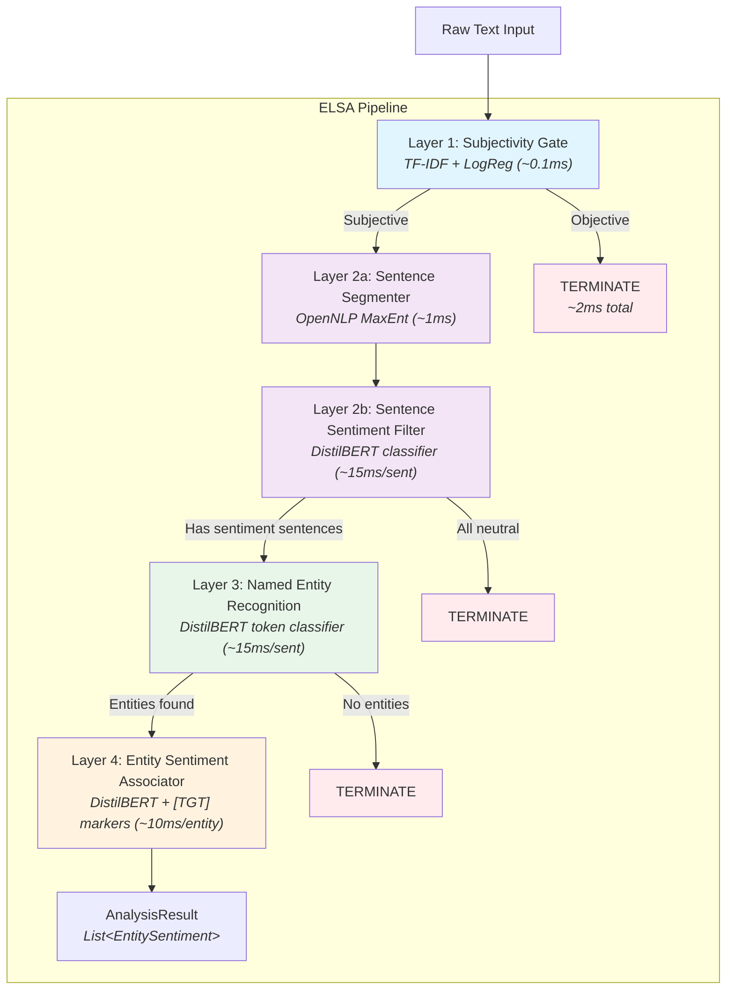
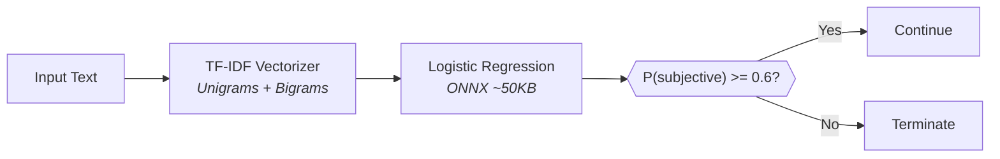
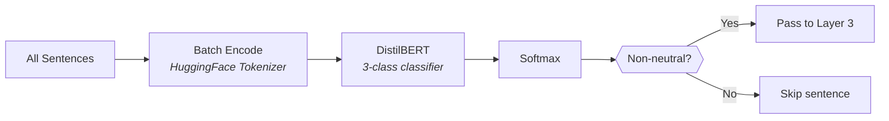
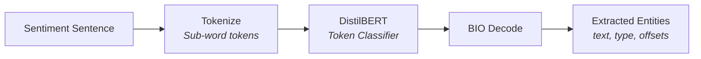
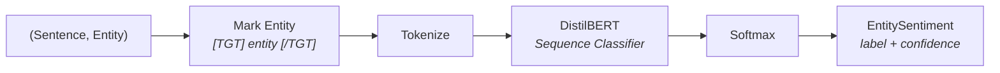
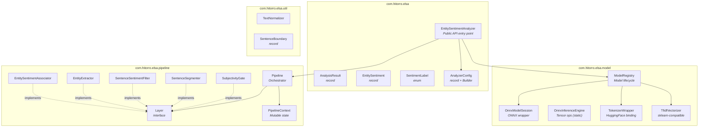
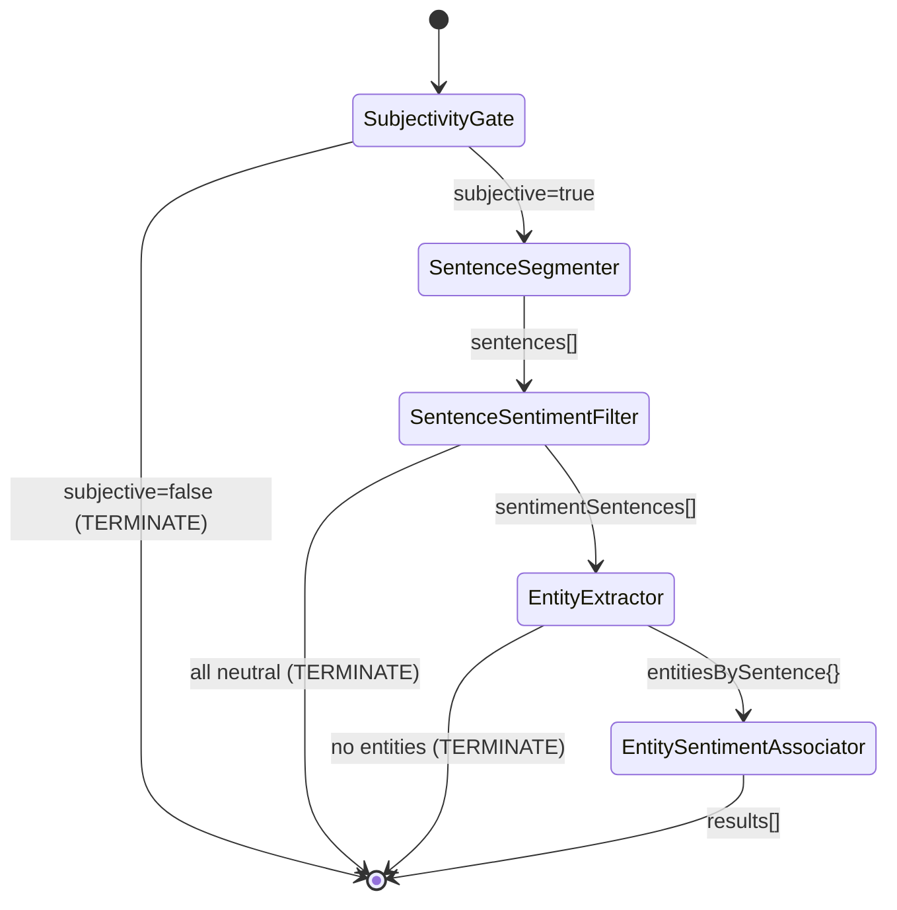
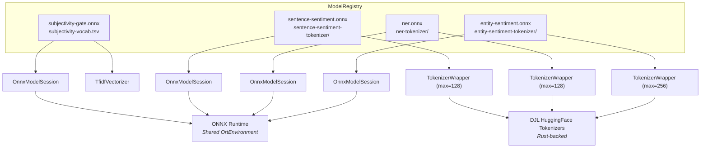
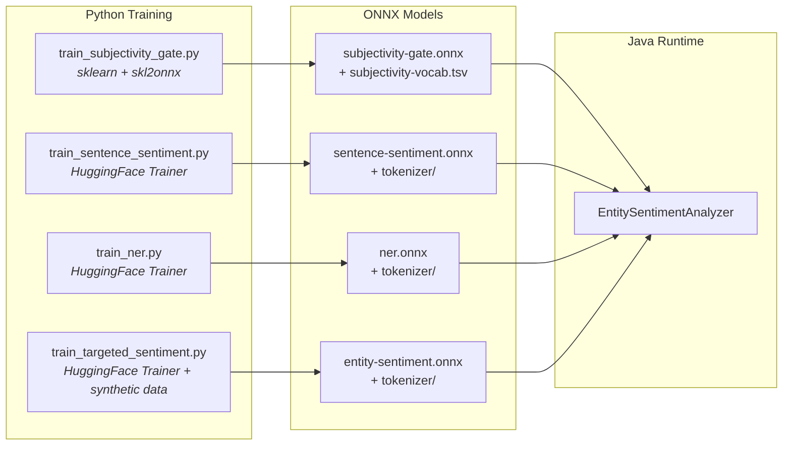

# ELSA - Entity-Level Sentiment Analysis

A high-performance Java library for extracting **entity-level sentiment** from text using a layered ML pipeline backed by ONNX Runtime. Given a block of text, ELSA identifies named entities (people, organizations, locations, products) and determines the sentiment expressed toward each one, including who holds that opinion.

```
Input:  "Chris hates Android Phones but loves the iPhone camera."

Output:
  Android Phones  [PRODUCT]  NEGATIVE  (0.92)  holder: Chris
  iPhone          [PRODUCT]  POSITIVE  (0.88)  holder: Chris
```

## Table of Contents

- [Quick Start](#quick-start)
- [Architecture Overview](#architecture-overview)
- [Pipeline Layers](#pipeline-layers)
- [Class Reference](#class-reference)
- [Configuration](#configuration)
- [Building](#building)
- [Training Models](#training-models)
- [Integration Guide](#integration-guide)
- [Performance](#performance)
- [Testing](#testing)

---

## Quick Start

### 1. Prerequisites

- Java 21+
- Maven 3.8+
- Python 3.10+ (for model training only)

### 2. Build

```bash
./scripts/build.sh
```

### 3. Get the models

The Java pipeline loads four ONNX models from `models/`. They are **not committed** to this repo. Pick one of:

```bash
# Option A — fetch prebuilt weights from a private Hugging Face Hub repo
#   Requires HF_TOKEN with read access to chrisxyz11/elsa-models
export HF_TOKEN=hf_...   # from https://huggingface.co/settings/tokens
./scripts/fetch-models.sh

# Option B — synthetic stubs for CI / integration testing (seconds)
./scripts/generate-test-models.sh

# Option C — train from scratch (~1 hour total on Apple Silicon, MPS required)
./scripts/train-models.sh
```

### 4. Run Performance Analysis

```bash
./scripts/run-analysis.sh
```

### 5. Use in Code

```java
var analyzer = EntitySentimentAnalyzer.create(
    AnalyzerConfig.builder()
        .modelDirectory(Path.of("models"))
        .build());

AnalysisResult result = analyzer.analyze(
    "Taylor Swift's Eras Tour was incredible. Drake's album was disappointing.");

for (EntitySentiment es : result.entities()) {
    System.out.printf("%-20s [%-8s] %s (%.2f)%n",
        es.entity(), es.entityType(), es.sentiment(), es.confidence());
}
// Taylor Swift         [PER     ] POSITIVE (0.91)
// Eras Tour            [MISC    ] POSITIVE (0.88)
// Drake                [PER     ] NEGATIVE (0.85)

analyzer.close();
```

---

## Architecture Overview

ELSA uses a **4-layer pipeline** architecture where each layer can short-circuit processing. Text flows through progressively deeper analysis, with early termination when there is nothing meaningful to extract.



### Short-Circuit Optimization

Every layer can call `ctx.terminate()` to halt the pipeline. This means:

| Scenario | Layers Executed | Typical Time |
|----------|----------------|--------------|
| Objective/factual text | Layer 1 only | ~2 ms |
| Subjective but all neutral sentences | Layers 1, 2a, 2b | ~20 ms |
| Sentiment sentences but no entities | Layers 1-3 | ~35 ms |
| Full analysis with entities | All layers | ~40-100 ms |

---

## Pipeline Layers

### Layer 1: Subjectivity Gate

Filters out objective/factual content before any expensive processing.



- **Model**: Scikit-learn TfidfVectorizer + LogisticRegression, exported to ONNX
- **Training data**: Rotten Tomatoes subjectivity dataset
- **Cost**: ~0.1 ms (negligible)
- **Files**: `subjectivity-gate.onnx`, `subjectivity-vocab.tsv`

### Layer 2a: Sentence Segmenter

Splits text into sentences with accurate character offsets.

- **Implementation**: Apache OpenNLP `SentenceDetectorME` with `en-sent.bin`
- **Fallback**: Regex-based splitting on `[.!?]` followed by whitespace
- **Special case**: Short text (<280 chars with no sentence-ending punctuation) treated as a single sentence

### Layer 2b: Sentence Sentiment Filter

Classifies each sentence and removes neutral ones.



- **Model**: Fine-tuned DistilBERT, 3-class (Negative=0, Neutral=1, Positive=2)
- **Training data**: SST-2 (Stanford Sentiment Treebank)
- **Max sequence length**: 128 tokens
- **Batched**: All sentences in a single ONNX inference call
- **Files**: `sentence-sentiment.onnx`, `sentence-sentiment-tokenizer/`

### Layer 3: Named Entity Recognition

Extracts entity spans using BIO (Begin/Inside/Outside) token tagging.



**BIO Label Scheme (9 labels)**:

| Label | Meaning |
|-------|---------|
| `O` | Outside any entity |
| `B-PER` / `I-PER` | Person |
| `B-ORG` / `I-ORG` | Organization |
| `B-LOC` / `I-LOC` | Location |
| `B-MISC` / `I-MISC` | Miscellaneous |

- **Model**: Fine-tuned DistilBERT for token classification
- **Training data**: WikiANN (PanX) English NER dataset
- **Sub-word reassembly**: Tokens are merged back into entity spans using character offsets
- **Per-sentence**: Each sentence runs independently through NER
- **Files**: `ner.onnx`, `ner-tokenizer/`

### Layer 4: Entity Sentiment Associator

Determines the sentiment directed at each specific entity using target marking.



**Target marking example**:
```
Original:  "Chris hates Android Phones but loves the iPhone camera."
Marked:    "Chris hates [TGT] Android Phones [/TGT] but loves the iPhone camera."
```

- **Model**: Fine-tuned DistilBERT with added `[TGT]`/`[/TGT]` special tokens
- **Holder detection**: First `PER` entity in the same sentence is assigned as opinion holder
- **Max sequence length**: 256 tokens
- **Batched**: All (sentence, entity) pairs in a single inference call
- **Files**: `entity-sentiment.onnx`, `entity-sentiment-tokenizer/`

---

## Class Reference

### Package Structure



### Core Types

#### `EntitySentimentAnalyzer`

The public API. Thread-safe, `AutoCloseable`.

| Method | Description |
|--------|-------------|
| `create(AnalyzerConfig)` | Factory method. Loads models, builds pipeline. |
| `analyze(String)` | Analyze a single text. Returns `AnalysisResult`. |
| `analyzeBatch(List<String>)` | Analyze multiple texts. Returns results in order. |
| `close()` | Release all ONNX sessions and resources. |

#### `AnalysisResult` (record)

| Field | Type | Description |
|-------|------|-------------|
| `originalText` | `String` | The input text |
| `entities` | `List<EntitySentiment>` | All entity-sentiment associations |
| `subjectiveContent` | `boolean` | Whether text passed subjectivity gate |
| `sentencesAnalyzed` | `int` | Sentences that contained sentiment |
| `sentencesSkipped` | `int` | Neutral sentences filtered out |
| `elapsed` | `Duration` | Total processing time |

#### `EntitySentiment` (record)

| Field | Type | Description |
|-------|------|-------------|
| `entity` | `String` | Entity text (e.g., "iPhone") |
| `entityType` | `String` | NER type: `PER`, `ORG`, `LOC`, `MISC` |
| `sentiment` | `SentimentLabel` | `POSITIVE`, `NEGATIVE`, `NEUTRAL`, `MIXED` |
| `confidence` | `double` | Confidence score [0, 1] |
| `holder` | `String` | Opinion holder (nullable) |
| `startOffset` | `int` | Character start in original text |
| `endOffset` | `int` | Character end in original text |
| `sourceSentence` | `String` | Source sentence |

#### `SentimentLabel` (enum)

| Value | Index | Description |
|-------|-------|-------------|
| `NEGATIVE` | 0 | Negative sentiment |
| `NEUTRAL` | 1 | Neutral / no sentiment |
| `POSITIVE` | 2 | Positive sentiment |
| `MIXED` | - | Top-2 non-neutral classes within 0.15 of each other |

#### `AnalyzerConfig` (record + Builder)

| Field | Default | Description |
|-------|---------|-------------|
| `modelDirectory` | `Path.of("models")` | Directory containing ONNX models |
| `subjectivityThreshold` | `0.6` | Minimum P(subjective) to continue |
| `sentimentThreshold` | `0.5` | Minimum non-neutral probability |
| `maxTextLength` | `10,000` | Character truncation limit |
| `onnxThreads` | `2` | Intra-op threads per ONNX session |
| `entityTypes` | `Set.of()` | Entity type filter (empty = all) |

### Layer Interface

```java
public interface Layer {
    void process(PipelineContext ctx);
    String name();
}
```

All layers implement this interface. The `PipelineContext` is a mutable state object that flows through the pipeline, accumulating results at each stage.



### Model Infrastructure



---

## Configuration

### Default Properties

Located at `src/main/resources/elsa-defaults.properties`:

```properties
elsa.subjectivity.threshold=0.6
elsa.sentiment.threshold=0.5
elsa.max.text.length=10000
elsa.onnx.threads=2
```

### Programmatic Configuration

```java
AnalyzerConfig config = AnalyzerConfig.builder()
    .modelDirectory(Path.of("/opt/elsa/models"))
    .subjectivityThreshold(0.7)      // stricter subjectivity filter
    .sentimentThreshold(0.6)          // stricter sentiment filter
    .maxTextLength(20_000)            // allow longer texts
    .onnxThreads(4)                   // more parallelism per model
    .entityTypes(Set.of("PER", "ORG")) // only people and organizations
    .build();
```

### Graceful Degradation

Missing models are automatically skipped. This allows partial deployments:

| Models Present | Behavior |
|---------------|----------|
| All 4 layers | Full entity-level sentiment analysis |
| No Layer 1 | Skips subjectivity filter, processes all text |
| No Layer 4 | Extracts entities but uses sentence-level sentiment |
| Only Layer 3 | NER-only mode (entity extraction without sentiment) |

---

## Building

### Prerequisites

| Tool | Version | Purpose |
|------|---------|---------|
| JDK | 21+ | Compilation and runtime |
| Maven | 3.8+ | Build and dependency management |
| Python | 3.10+ | Model training (optional) |
| pip | latest | Python dependency management |

### Build Commands

```bash
# Full build with tests
mvn clean package

# Compile only (fast)
mvn compile

# Skip tests
mvn package -DskipTests

# Install to local Maven repository
mvn install
```

### Build Scripts

Use the provided scripts in `scripts/`:

```bash
# Build the Java project
./scripts/build.sh

# Train all ML models
./scripts/train-models.sh

# Generate synthetic test models (for CI/testing)
./scripts/generate-test-models.sh

# Run the performance analysis
./scripts/run-analysis.sh

# Run all tests
./scripts/test.sh
```

---

## Training Models

### Overview



### Setup Python Environment

```bash
cd training
python -m venv venv
source venv/bin/activate  # or venv\Scripts\activate on Windows
pip install -r requirements.txt
```

### Train Each Layer

Models must be trained in order (each layer is independent, but it is logical to train sequentially):

```bash
# Layer 1: Subjectivity Gate
# Dataset: Rotten Tomatoes subjectivity corpus
# Output: models/subjectivity-gate.onnx, models/subjectivity-vocab.tsv
python training/layer1_subjectivity/train_subjectivity_gate.py

# Layer 2: Sentence Sentiment
# Dataset: SST-2 (Stanford Sentiment Treebank)
# Output: models/sentence-sentiment.onnx, models/sentence-sentiment-tokenizer/
python training/layer2_sentence_sentiment/train_sentence_sentiment.py

# Layer 3: Named Entity Recognition
# Dataset: WikiANN (PanX) English
# Output: models/ner.onnx, models/ner-tokenizer/
python training/layer3_ner/train_ner.py

# Layer 4: Entity-Level Targeted Sentiment
# Dataset: Synthetic templates (or SemEval 2014 Task 4)
# Output: models/entity-sentiment.onnx, models/entity-sentiment-tokenizer/
python training/layer4_entity_sentiment/train_targeted_sentiment.py
```

### Training Data Summary

| Layer | Dataset | Size | Metric | Result |
|-------|---------|------|--------|--------|
| 1 - Subjectivity | Rotten Tomatoes | ~10K | Accuracy (CV) | ~92% |
| 2 - Sentiment | SST-2 | ~67K | Accuracy | 90.0% |
| 3 - NER | WikiANN English | ~20K | F1 (seqeval) | 80.4% |
| 4 - Entity Sentiment | Synthetic templates | ~27K | Accuracy | 100%* |

*Layer 4 achieves 100% on synthetic data. Real-world accuracy depends on domain.

### Generating Synthetic Test Models

For CI/CD and integration testing without training real models:

```bash
python training/create_test_models.py
```

This creates structurally valid but semantically random ONNX models in `models/`. Useful for verifying the Java pipeline runs end-to-end without errors.

### NER: Trained Model vs Dictionary

The NER layer (Layer 3) uses a **trained neural network**, not a dictionary:

- **Generalizes** to entities never seen during training
- Learns patterns like capitalization, context words ("CEO", "Inc."), position
- **No retraining needed** when new entities appear
- Trained on WikiANN which covers diverse entity types across many domains

---

## Integration Guide

### Maven Dependency

After building and installing ELSA to your local Maven repository:

```xml
<dependency>
    <groupId>com.hitorro</groupId>
    <artifactId>elsa</artifactId>
    <version>1.0.0-SNAPSHOT</version>
</dependency>
```

### Required Runtime Dependencies

ELSA pulls these transitively via Maven:

```xml
<!-- ONNX Runtime (ML inference) -->
<dependency>
    <groupId>com.microsoft.onnxruntime</groupId>
    <artifactId>onnxruntime</artifactId>
    <version>1.20.0</version>
</dependency>

<!-- DJL HuggingFace Tokenizers (Rust-backed, fast) -->
<dependency>
    <groupId>ai.djl.huggingface</groupId>
    <artifactId>tokenizers</artifactId>
    <version>0.30.0</version>
</dependency>

<!-- OpenNLP (sentence segmentation) -->
<dependency>
    <groupId>org.apache.opennlp</groupId>
    <artifactId>opennlp-tools</artifactId>
    <version>2.5.0</version>
</dependency>

<!-- SLF4J (logging) -->
<dependency>
    <groupId>org.slf4j</groupId>
    <artifactId>slf4j-api</artifactId>
    <version>2.0.16</version>
</dependency>
```

### Basic Usage

```java
import com.hitorro.elsa.*;
import java.nio.file.Path;

// Create analyzer (do this once, reuse across requests)
EntitySentimentAnalyzer analyzer = EntitySentimentAnalyzer.create(
    AnalyzerConfig.builder()
        .modelDirectory(Path.of("/path/to/models"))
        .build());

// Analyze text
AnalysisResult result = analyzer.analyze(
    "Amazon Web Services is excellent but Oracle Cloud is frustrating.");

// Check results
if (result.hasEntities()) {
    for (EntitySentiment es : result.entities()) {
        System.out.printf("Entity: %s [%s]%n", es.entity(), es.entityType());
        System.out.printf("  Sentiment: %s (%.2f)%n", es.sentiment(), es.confidence());
        System.out.printf("  Position:  %d-%d%n", es.startOffset(), es.endOffset());
        System.out.printf("  Sentence:  %s%n", es.sourceSentence());
        if (es.holder() != null) {
            System.out.printf("  Holder:    %s%n", es.holder());
        }
    }
}

// Metadata
System.out.printf("Subjective: %s%n", result.subjectiveContent());
System.out.printf("Sentences analyzed: %d, skipped: %d%n",
    result.sentencesAnalyzed(), result.sentencesSkipped());
System.out.printf("Processing time: %d ms%n", result.elapsed().toMillis());

// Clean up when done
analyzer.close();
```

### Batch Processing

```java
List<String> texts = List.of(
    "Tesla's autopilot is impressive.",
    "The restaurant food was terrible.",
    "Apple announced new products today."
);

List<AnalysisResult> results = analyzer.analyzeBatch(texts);
```

### Spring Boot Integration

```java
@Configuration
public class ElsaConfig {

    @Bean(destroyMethod = "close")
    public EntitySentimentAnalyzer entitySentimentAnalyzer(
            @Value("${elsa.model.dir}") String modelDir) throws Exception {
        return EntitySentimentAnalyzer.create(
            AnalyzerConfig.builder()
                .modelDirectory(Path.of(modelDir))
                .build());
    }
}

@Service
public class SentimentService {

    private final EntitySentimentAnalyzer analyzer;

    public SentimentService(EntitySentimentAnalyzer analyzer) {
        this.analyzer = analyzer;
    }

    public AnalysisResult analyze(String text) {
        return analyzer.analyze(text);
    }
}
```

### Filtering by Entity Type

```java
// Only extract people and organizations
var analyzer = EntitySentimentAnalyzer.create(
    AnalyzerConfig.builder()
        .modelDirectory(Path.of("models"))
        .entityTypes(Set.of("PER", "ORG"))
        .build());
```

### Thread Safety

`EntitySentimentAnalyzer` is thread-safe. Create one instance and share it:

```java
// Safe: shared across threads
private final EntitySentimentAnalyzer analyzer = ...;

// In request handler (any thread)
AnalysisResult result = analyzer.analyze(text);
```

---

## Performance

### Throughput

Measured on Apple Silicon (M-series), ONNX Runtime with 2 intra-op threads:

| Metric | Value |
|--------|-------|
| **Model load time** | ~850 ms (one-time) |
| **Avg per text** | 64 ms |
| **Avg per sentence** | 40 ms |
| **P50 per sentence** | 40 ms |
| **P95 per text** | 120 ms |
| **Throughput** | 15.5 texts/sec, 25 sentences/sec |
| **Objective text (short-circuit)** | 2 ms |

### Per-Layer Cost

```mermaid
gantt
    title Pipeline Execution Timeline (typical 2-sentence text, ~75ms)
    dateFormat X
    axisFormat %L ms

    section Layer 1
    Subjectivity Gate (TF-IDF + LogReg)  :0, 1

    section Layer 2a
    Sentence Segmentation (OpenNLP)      :1, 3

    section Layer 2b
    Sentence Sentiment (DistilBERT)      :3, 18

    section Layer 3
    NER - Sentence 1 (DistilBERT)        :18, 33
    NER - Sentence 2 (DistilBERT)        :33, 48

    section Layer 4
    Entity Sentiment (batched)           :48, 75
```



| Layer | Model | Cost |
|-------|-------|------|
| Layer 1 - Subjectivity | TF-IDF + LogReg (50KB) | ~0.1 ms |
| Layer 2a - Segmentation | OpenNLP MaxEnt | ~1-2 ms |
| Layer 2b - Sentence Sentiment | DistilBERT (267MB) | ~15 ms/sentence (batched) |
| Layer 3 - NER | DistilBERT (261MB) | ~15 ms/sentence |
| Layer 4 - Entity Sentiment | DistilBERT (268MB) | ~10-15 ms/entity (batched) |

### Memory

| Component | Size |
|-----------|------|
| ONNX models on disk | ~800 MB total |
| Quantized alternative (Layer 2) | ~67 MB |
| Runtime memory per session | ~300 MB |

---

## Testing

### Run Tests

```bash
# All tests
mvn test

# Specific test class
mvn test -Dtest=EntitySentimentAnalyzerIntegrationTest

# With debug logging
mvn test -Dorg.slf4j.simpleLogger.defaultLogLevel=debug
```

### Test Coverage

| Test Class | Scope |
|------------|-------|
| `EntitySentimentAnalyzerIntegrationTest` | End-to-end pipeline with 16 scenarios |
| `AnalyzerConfigTest` | Builder pattern, defaults, custom values |
| `SentimentLabelTest` | Probability mapping, MIXED detection |
| `SentenceSegmenterTest` | Short/long text, offset accuracy |
| `PipelineContextTest` | State management, timing, counts |
| `EntitySentimentAssociatorTest` | `[TGT]` entity marking |
| `TfidfVectorizerTest` | Vocab loading, TF-IDF math, L2 norm |
| `OnnxInferenceEngineTest` | Softmax numerical stability |
| `PerformanceAnalysis` | Benchmarking with 24 diverse inputs |

### Integration Test Scenarios

The integration test covers:
- Null, empty, and blank input handling
- Product reviews, financial text, entertainment, sports, politics, technology
- Unicode text, very long text, special characters
- Batch processing
- Thread safety (8 concurrent threads)
- Entity type filtering
- Custom threshold configuration

---

## Project Structure

```
entity_level_sentiment/
├── pom.xml
├── README.md
├── scripts/
│   ├── build.sh
│   ├── test.sh
│   ├── train-models.sh
│   ├── generate-test-models.sh
│   └── run-analysis.sh
├── src/
│   ├── main/
│   │   ├── java/com/hitorro/elsa/
│   │   │   ├── EntitySentimentAnalyzer.java    # Public API
│   │   │   ├── AnalysisResult.java             # Output record
│   │   │   ├── EntitySentiment.java            # Entity-sentiment record
│   │   │   ├── SentimentLabel.java             # Enum: POS/NEG/NEU/MIXED
│   │   │   ├── AnalyzerConfig.java             # Configuration + Builder
│   │   │   ├── model/
│   │   │   │   ├── ModelRegistry.java          # Model lifecycle manager
│   │   │   │   ├── OnnxModelSession.java       # ONNX Runtime wrapper
│   │   │   │   ├── OnnxInferenceEngine.java    # Tensor operations
│   │   │   │   ├── TokenizerWrapper.java       # HuggingFace tokenizer
│   │   │   │   └── TfidfVectorizer.java        # TF-IDF (sklearn compat)
│   │   │   ├── pipeline/
│   │   │   │   ├── Pipeline.java               # Layer orchestrator
│   │   │   │   ├── Layer.java                  # Layer interface
│   │   │   │   ├── PipelineContext.java         # Mutable pipeline state
│   │   │   │   ├── SubjectivityGate.java       # Layer 1
│   │   │   │   ├── SentenceSegmenter.java      # Layer 2a
│   │   │   │   ├── SentenceSentimentFilter.java # Layer 2b
│   │   │   │   ├── EntityExtractor.java        # Layer 3
│   │   │   │   └── EntitySentimentAssociator.java # Layer 4
│   │   │   └── util/
│   │   │       ├── TextNormalizer.java
│   │   │       └── SentenceBoundary.java
│   │   └── resources/
│   │       └── elsa-defaults.properties
│   └── test/java/com/hitorro/elsa/
│       ├── EntitySentimentAnalyzerIntegrationTest.java
│       ├── PerformanceAnalysis.java
│       ├── AnalyzerConfigTest.java
│       ├── SentimentLabelTest.java
│       ├── model/
│       │   ├── OnnxInferenceEngineTest.java
│       │   └── TfidfVectorizerTest.java
│       └── pipeline/
│           ├── EntitySentimentAssociatorTest.java
│           ├── PipelineContextTest.java
│           └── SentenceSegmenterTest.java
├── models/                          # ONNX models (generated)
│   ├── subjectivity-gate.onnx
│   ├── subjectivity-vocab.tsv
│   ├── sentence-sentiment.onnx
│   ├── sentence-sentiment-tokenizer/
│   ├── ner.onnx
│   ├── ner-tokenizer/
│   ├── entity-sentiment.onnx
│   └── entity-sentiment-tokenizer/
└── training/                        # Python training scripts
    ├── requirements.txt
    ├── create_test_models.py
    ├── layer1_subjectivity/
    ├── layer2_sentence_sentiment/
    ├── layer3_ner/
    └── layer4_entity_sentiment/
```
